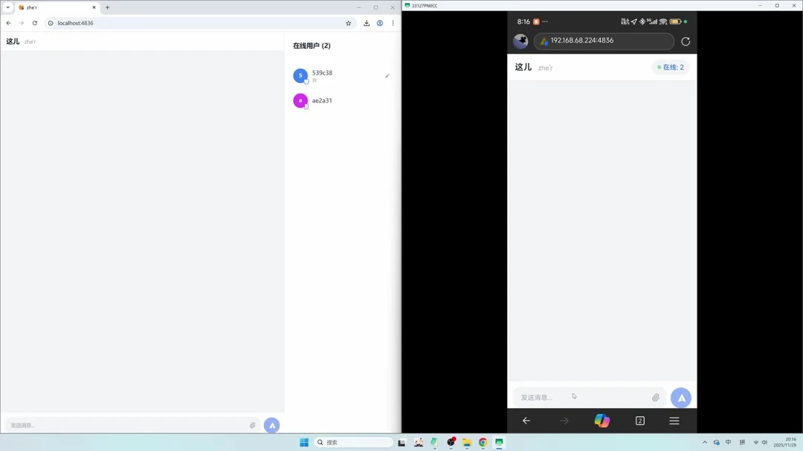
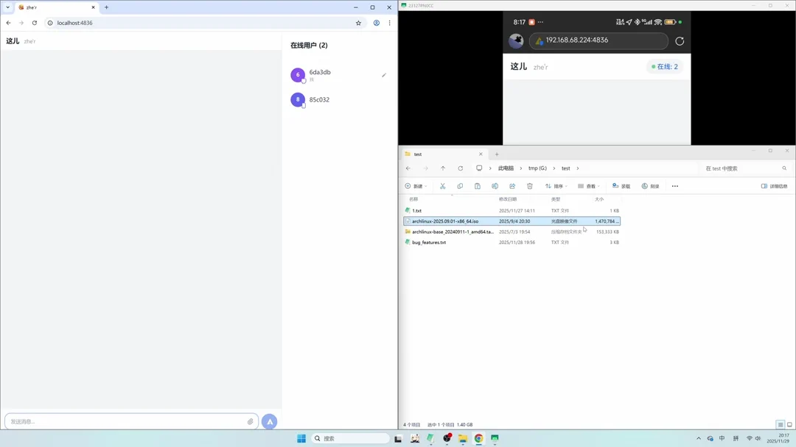

# zhe'r (这儿)

[English](./README.md) | [中文](./README_cn.md)

A lightweight, pure LAN application for instant chat and file sharing. No internet required, no installation needed—what you see is what you get.

## ✨ Features

- **🚀 Pure LAN Experience**: Works entirely within your local network. No external servers, no internet dependency. Just run and connect.
- **📂 Fast File Transfer**: Drag and drop files to share them instantly with everyone on the network. High-speed transfer limited only by your WiFi/LAN speed.
- **📋 Seamless Text Copying**: Send text, links, or code snippets across devices. One-click to copy content directly to your system clipboard—perfect for transferring text between phone and computer.
- **📱 Cross-Platform & Mobile Ready**: Run the server on your PC (Windows/Linux/macOS) and access it from any device (iOS, Android, Tablets) via browser. Responsive design adapts to any screen size.




## 🛠️ Technology Stack

- **Backend**: Rust (Axum + Socketioxide) - High performance and safety.
- **Frontend**: Vue 3 + Tailwind CSS - Modern, reactive, and beautiful UI.

## 🏗️ Building

Requirements: Node.js and Rust.

### Windows

```bat
build.bat
```

### Linux / macOS

```bash
./build.sh
```

## 🚀 Usage

1. Run the generated executable (`zher.exe` or `zher`).
2. Open your browser and go to `http://localhost:4836`.
3. Share the URL (e.g., `http://192.168.1.x:4836`) with other devices on the same WiFi/LAN.

## License

MIT
